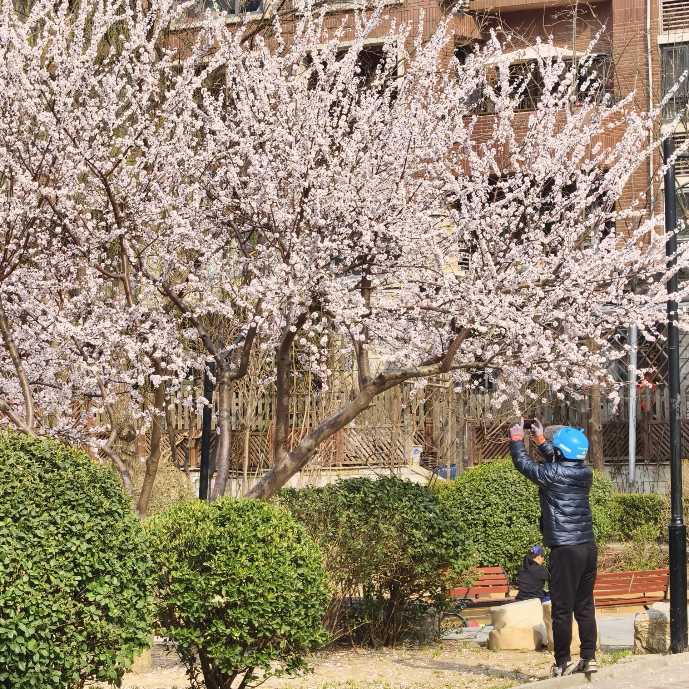

> 硬地周报是一个记录我每周所读所看所想的地方。
> 通过最后的「阅读原文」可以查看带完整链接的版本。
> 作为一名产品经理，我关注互联网与 AI，同时关心技术如何影响人与世界的连接方式。

---

- 就算赶时间
- 也要留下春天

---

## 微信 ClawBot

- 本周最让我震惊的新闻无疑是微信接入了 OpenClaw。
- 在我的认知里，这对于微信来说是一个非常激进的动作，即使是通过插件的形式。
- 当然 OpenClaw 生来就是为通过各种 IM 使用所打造的，微信作为中文最大的 IM 接入也非常合情合理。
- 微信肯定一直在思考，可能这个时间点，选择一个开源开放自托管的 Agent 进行尝试来说最稳妥。

---

## 播客-诗梳风：EP9 教朋友们用 AI 时想到的 · Thoughts
[xiaoyuzhoufm.com](https://www.xiaoyuzhoufm.com/episode/69ba4713f8b8079bfaf3b640)

- 重轻总结了他在给传统行业做 AI 培训时遇到的一些现象：
- 现象 1：人们总在寻找 AI 不行的证据；
- 现象 2：觉得现在学 AI 为时尚早；
- 现象 3：想拿出整块时间"学会" AI。
- 讲的真的很好。就包括我自己，也会偶尔有 AI 这块不行，还得亲子来的时候。
- 但是我还是多少觉得有些太精英主义了，当然要分语境是面向谁来说的。
