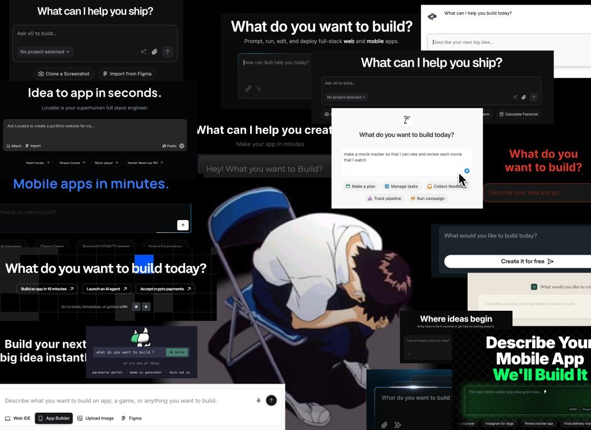

> 硬地周报是一个记录我每周所读所看所想的地方。
> 通过最后的「阅读原文」可以查看带完整链接的版本。
> 作为一名产品经理，我关注互联网与 AI，同时关心技术如何影响人与世界的连接方式。

---

上周有点忙，鸽了一周，所以看的也不算多。

---

- 其实问题从来都是要做什么。
- 只是因为众所周知的原因，
- 今天越来越多的人开始问这个问题。

---

## NotebookLM

[NotebookLM](https://jasonspielman.com/notebooklm)

- 这篇是 NotebookLM 的设计师于 2024 年发布的文章，介绍了 NotebookLM 的设计思路。
- 我很喜欢 NBLM 的设计。
- 因为它看上去是多么的显而易见。真的就是：

> Design is not just what it looks like and feels like. Design is how it works.

- 但是我却有点悲观，也许是 AI 时代是设计最后的高光了。

---

## Claude Code Unpacked

[Claude Code Unpacked](https://ccunpacked.dev/)

- 之前 Cluade Code 源码发送了泄露。
- 有人做了个网站，通过交互式的方式，告诉你：
- 当你在 Claude Code 中输入一条消息时，实际发生了什么？
- 做的很棒，可以学习下。