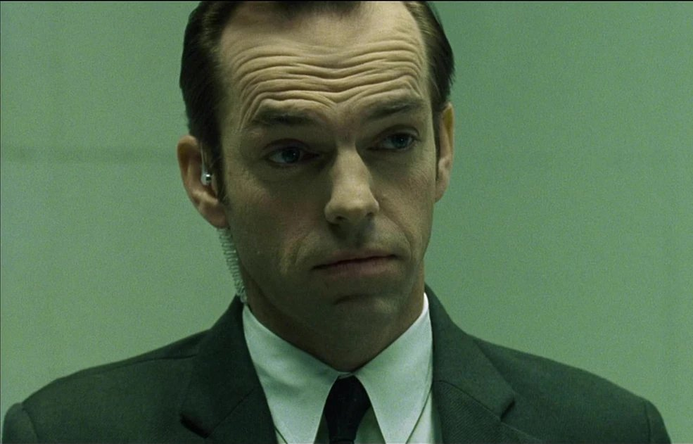
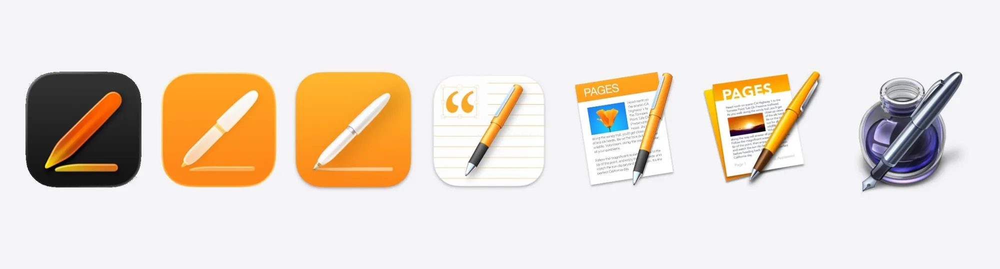

每周都会看很多东西，从上个月开始决定把看过的有一些价值的东西记录下来并附上个人想法，为 AI Agent 取代我做准备。😆

[x.com](https://x.com/ilmoi/status/2018058078386626781?s=20)
> when you realize that matrix called the bad guys “agents”; and 25 years later we literally invented them

---

上周最火的话题无疑是 Openclaw，因此有 2 篇相关的内容：

## 1.OpenClaw (Formerly Clawdbot) Showed Me What the Future of Personal AI Assistants Looks Like
[macstories.net](https://www.macstories.net/stories/clawdbot-showed-me-what-the-future-of-personal-ai-assistants-looks-like/)
- 关于当下最火的 AI assistant Clawdbt 的分析。
- 最后一段也是自 AI 越来越强后的一个思考，未来的 App 存在形态到底是什么样的？

## 2.Full Interview: Clawdbot’s Peter Steinberger Makes First Public Appearance Since Launch
[youtube.com](https://www.youtube.com/watch?v=qyjTpzIAEkA)
- 听到 Moltbot 自己把不支持的语音格式转成文字的时候，真的汗毛都立起来了。
- 同意关于 MCP 的观点，MCP 没有新东西，有统一的协议会降低很多摩擦，但是 Agent 并不在意。Skills 在我看来是有新东西。
- 同意关于 Opus 和 Codex 的观点。不过我基本没有同时使用 2 个模型，就我的经验来说，Codex 在 coding 确实很靠谱，很少需要返工。Claude 的模型确实更友好，但是以我过去的经验出现问题的概率很大。
- 很多 App 会消失，不是说人们不需要了，而是用户变成了 Agent。但是这个问题主要在于整个商业模式的重塑。所以目前大公司确实没法做。
- 代码不再是资产，有价值的是想法、眼球、还有品牌。对应到 Sam 最近的谈话，「高能动性、善于产生想法」是重要的技能，编程不再是。
- 问题：如果不是每个人都需要一台 Mac Mini，那大家是不是也不需要豆包手机，所以需要的是什么？

## 3.choosing friction
[phirephoenix.com](https://phirephoenix.com/blog/2025-10-11/friction)
- 这其实是更早看到的一篇文章，之所以又想到是因为和 ChatGPT 聊关于 假如我做一个 Agent 替我获取信息，我会失去什么？它提到了「摩擦」这个词，突然想起来前段时间看过的这篇文章，就是关于摩擦的，通过浏览器历史记录找到了。
- 我觉得这种问题很容易讨论到哲学层面，但你可以思考下在哪里放弃了摩擦，在哪里选择了摩擦？
- BTW，以我半吊子英文的水平来看，文章很适合精读对学习英语也有帮助。

## 4.Unrolling the Codex agent loop
[openai.com](https://openai.com/index/unrolling-the-codex-agent-loop/)
- 这篇是 OpenAI 发布的介绍 codex 的核心工作机制：Agent Loop 的文章。包括了
	- 如何构建实际的 initial prompt
	- Agent loop 的核心是不断地把协议层的 output_item.added 解析为 Agent 事件，然后注入到新一轮的请求中，直到没有需要调用的 tools（简单理解） 
	- 此外就是一些上下文工程优化，包括 prompt caching、自动压缩，有些和 Manus 的分享思路类似
- 结合 codex 的开源项目，对理解如何实现一个 Agent 很有帮助。

## 5.OpenAI Town Hall with Sam
[youtube.com](https://www.youtube.com/watch?v=Wpxv-8nG8ecAltman)
- 看的文字总结版。
- 关于最后的问题印象深刻：
	- Q：AI 时代最重要的技能是什么？
	- A：变得高能动性（high agency）、善于产生想法、非常有韧性、非常能适应快速变化的世界，我认为这些会比任何具体技能都重要。而且我认为这些都是可以学的。

## 6

[mastodon.social](https://mastodon.social/@heliographe_studio/115890819509545391)
> If you put the Apple icons in reverse it looks like the portfolio of someone getting really really good at icon design

- 确实
